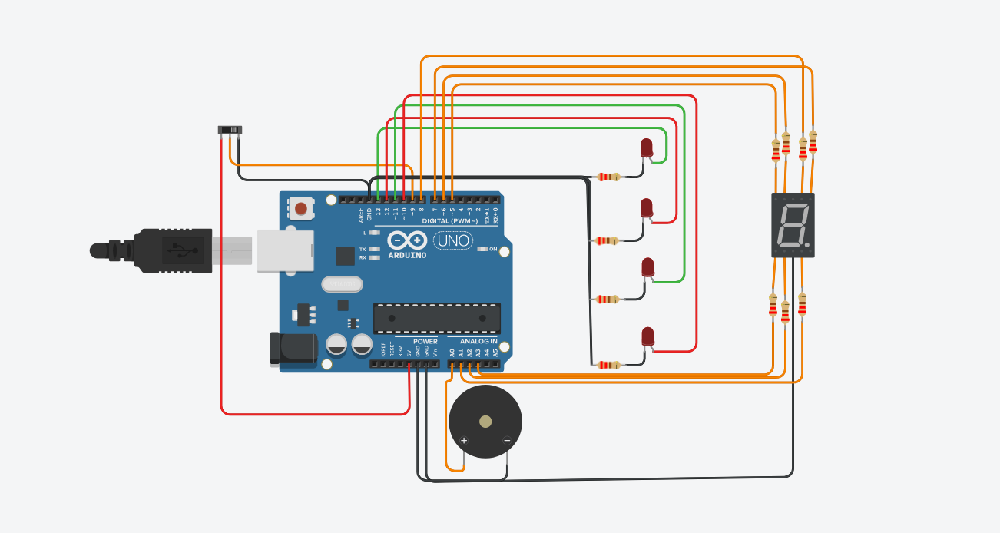

# Ejemplo Documentación 

## Integrantes 
- Franco Bulotas

## Proyecto: Estacion de Subtes.

## Descripción
De lo que se encarga este proyecto es de:
- Prender los LED en tanto y en cuenta pase por esa estacion.
- Sonar el buzzer cada vez que pasa por cada estacion.
- Cambiar el Display indicando cuantas estaciones faltan hasta Moreno.

## Función principal

La funcion principal de este proyecto se encarga de:
- En caso de que el interruptor este encendido, comienza a pasar por las estaciones y prende los leds de cada estacion cada 2seg, suena el buzzer y se modifica el Display, cuando apagamos el interruptor espera a llegar a Moreno y se detiene.

~~~ C (lenguaje en el que esta escrito)
# define INTERRUPTOR 9
# define LED_CONSTITUCION 13
# define LED_SAN_JUAN 12
# define LED_INDEPENDENCIA 11
# define LED_MORENO 10
# define LED_E A3
# define LED_D A2
# define LED_C A1
# define LED_B 7
# define LED_A 8
# define LED_F 6
# define LED_G 5
# define PIEZO A0

void setup()
{
  pinMode(LED_CONSTITUCION, OUTPUT);
  pinMode(LED_SAN_JUAN, OUTPUT);
  pinMode(LED_INDEPENDENCIA, OUTPUT);
  pinMode(LED_MORENO, OUTPUT);
  
  pinMode(LED_A, OUTPUT);
  pinMode(LED_B, OUTPUT);
  pinMode(LED_C, OUTPUT);
  pinMode(LED_D, OUTPUT);
  pinMode(LED_E, OUTPUT);
  pinMode(LED_F, OUTPUT);
  pinMode(LED_G, OUTPUT);
  
  pinMode(PIEZO, OUTPUT);
  
  Serial.begin(9600);
}

void loop()
{
  int estado_interruptor = digitalRead(INTERRUPTOR);
    
  if(estado_interruptor == HIGH){
	
    prenderConstitucion();
  
    delay(1900);

	prenderSanJuan();    
    
    delay(1900);

    prenderIndependencia();
    
    delay(1900);
    
    prenderMoreno();
    
    delay(1900);

    digitalWrite(LED_MORENO, LOW);

  }else {
  	apagarTodo();
  }
  
  Serial.println(estado_interruptor);
}

void prenderConstitucion(){
  	digitalWrite(LED_CONSTITUCION, HIGH);
  
  	tone(PIEZO, 1000);
  	delay(100);
  	noTone(PIEZO);	
  
	digitalWrite(LED_B, HIGH);
    digitalWrite(LED_C, HIGH);
    digitalWrite(LED_A, HIGH);
    digitalWrite(LED_G, HIGH);
    digitalWrite(LED_E, LOW);
  	digitalWrite(LED_F, LOW);
    digitalWrite(LED_D, HIGH);
}

void prenderSanJuan(){
  	digitalWrite(LED_CONSTITUCION, LOW);
   	digitalWrite(LED_SAN_JUAN, HIGH);
  	
  	tone(PIEZO, 1000);
  	delay(100);
  	noTone(PIEZO);	
  
	digitalWrite(LED_B, HIGH);
    digitalWrite(LED_C, LOW);
    digitalWrite(LED_A, HIGH);
    digitalWrite(LED_G, HIGH);
    digitalWrite(LED_E, HIGH);
    digitalWrite(LED_D, HIGH);
}

void prenderIndependencia(){
  	digitalWrite(LED_SAN_JUAN, LOW);
   	digitalWrite(LED_INDEPENDENCIA, HIGH);
  
  	tone(PIEZO, 1000);
  	delay(100);
  	noTone(PIEZO);	
  
	digitalWrite(LED_B, HIGH);
    digitalWrite(LED_C, HIGH);
    digitalWrite(LED_A, LOW);
    digitalWrite(LED_G, LOW);
    digitalWrite(LED_E, LOW);
    digitalWrite(LED_D, LOW);
}

void prenderMoreno(){
  	digitalWrite(LED_INDEPENDENCIA, LOW);
   	digitalWrite(LED_MORENO, HIGH);
  
  	tone(PIEZO, 1000);
  	delay(100);
  	noTone(PIEZO);	
  
	digitalWrite(LED_B, HIGH);
    digitalWrite(LED_C, HIGH);
    digitalWrite(LED_A, HIGH);
    digitalWrite(LED_G, LOW);
    digitalWrite(LED_E, HIGH);
    digitalWrite(LED_D, HIGH);
    digitalWrite(LED_F, HIGH);
}

void apagarTodo(){
    digitalWrite(LED_CONSTITUCION, LOW);
  	digitalWrite(LED_SAN_JUAN, LOW);
  	digitalWrite(LED_INDEPENDENCIA, LOW);
   	digitalWrite(LED_MORENO, LOW);
  
	digitalWrite(LED_B, LOW);
    digitalWrite(LED_C, LOW);
    digitalWrite(LED_A, LOW);
    digitalWrite(LED_G, LOW);
    digitalWrite(LED_E, LOW);
    digitalWrite(LED_D, LOW);
    digitalWrite(LED_F, LOW);
}

## :robot: Link al proyecto
- [proyecto] https://www.tinkercad.com/things/dWyzFZAF1pv
## :tv: Link al video del proceso
- [video](https://www.youtube.com/watch?v=VyGjE8kx-O0)

---
### Fuentes
- [Consejos para documentar](https://www.sohamkamani.com/how-to-write-good-documentation/#architecture-documentation).

- [Lenguaje Markdown](https://markdown.es/sintaxis-markdown/#linkauto).

- [Markdown Cheatsheet](https://github.com/adam-p/markdown-here/wiki/Markdown-Cheatsheet).

- [Tutorial](https://www.youtube.com/watch?v=oxaH9CFpeEE).

- [Emojis](https://gist.github.com/rxaviers/7360908).

---

